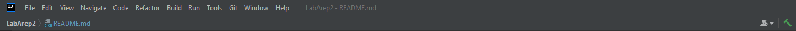

# Laboratorio 2 AREP
este laboratorio consiste en construir un servidor http que pueda manejar
diferentes tipos de archivos, y ademas de eso tener una aplicacion html css javascript
que use de recurso rest.

## Iniciando

### Prerrequisitos

* Git
* Java
* Maven
* 1 IDE (en este proyecto se trabajo en intellij)

### Instalando el proyecto

Lo primero será traer del repositorio remoto que encontramos en git
a nuestro entorno local para eso ejecutamos el siguiente comando en
la terminal donde funcionen los comandos git

```
git clone https://github.com/santiagoOsp01/LabArep2.git
```

Esto creará un repositorio localdonde accederemos y ejecutaremos 
con nuestro IDE escogido y el siguiente comando.

```
mvn package
```

luego de ejecutar el comando si estamos en intellij vamos a construir el proyecto presionando 
este boton de martillo verde que podemos ver en la siguiente imagen:



luego de que ya lo tengamos vamos a ejecutar la clase principal en este caso es serverHttp
y en esta clase corremos el metodo main, para que funcione nuestra clase


Eso hará que ya este disponible nuestra aplicacion. Para corroborar pega y copia o presiona
la siguiente url http://localhost:35000/index.html.

entramos en el siguiente link porque en este html esta la aplicacion que nos pidieron
para este laboratorio, podemos observar a continuacion:


y al buscar una pelicula aparecera lo siguiente.


## Corriendo los tests

en este proyecto no contamos con pruebas unitarias, sino que todas las pruebas
se hicieron con la aplicacion en marcha para verificar que si pueda con los
tipos de archivos que nos piden en este laboratorio html, css, js, y imagenes

vamos a primero probar con html:


css:


js:


imagenes jpg:


imagenes png:


tambien cuando un archivo no existe nos direcciona a la siguiente pagina:


y si no manejamos un formato nos lleva a lo siguiente:


## Documentación
Primero debemos ejecutar el siguiente comando para crear la documentación.
```
mvn javadoc:javadoc
```
En la siguiente ruta desde nuestra carpeta del proyecto podemos encontrar la documentación.

```
./target/site/apidocs/
```
Si ingresamos a esta podemos ver que hay un index.html que al abrir nos mostrara la siguiente pagina.


## Construido con

* [Maven](https://maven.apache.org/) - Administrador de dependencias
* [OMDAPI](https://www.omdbapi.com) - API externa de consulta

## Version

1.0-SNAPSHOT

## Autores

Santiago Ospina Mejia 

## Licencia

GNU General Public License family

### Extensibilidad

como podemos ver en este proyecto tenemos una clase abstracta que es file
y despues la implementamos ya sea si son imagenes o texto, poreso si queremos
agregar un nuevo tipo de archivo solo debemos de crear la clase para estos archivos
sin la necesidad de tener que cambiar gran cosa en nuestro codigo, incluso el agregar
un nuevo formato de imagenes

### Patrones

* se puede observar estilo arquitectónico Cliente-Servidor, donde podemos
ver un  fallo en nuetra arquitectura ya que nuestra aplicacion cuenta
con dos puntos de fallos que si se cae la api externa o nuestro back
nuestro aplicacion dejaria de funcionar, por otro lado nos ofrece la
centralizacion de los recursos, facil mantenimiento y un diseño que 
pueden entender gran parte de la gente

### Modularización
como ya lo mencionamos anteriormente tenemos dos clases que son responsable
de los diferentes formatos para imagenes y para texto, la cual cada una
tiene una responsabilidad unica:

* textController: contiene todo lo necesario para manejar los formatos de
texto que nos pidieron html css js

* imgController: contiene todo lo necesario para manejar los formatos de
  imagenes que codificamos en nuestro servidor que en este caso son 
  jpg, png, jpeg y gif
  


## Agradecimientos

* Luis Daniel Benavides profesor de AREP

## Tener en cuenta

no se implementaron todos los formatos de imagenes que existen, se implementaron
para 4 formatos ya anteriormente mencionados, si se sube un archivo al servidor
y no maneja ese formato va a salir el error ya mostrado anteriormente donde dice
archivo no soportado.
