# Laboratorio 4 AREP
este laboratorio consiste en construir un servidor http que pueda manejar
diferentes tipos de archivos, y servicios web de tipo GET y POST usando 
funciones lambda.

## Iniciando

### Prerrequisitos

* Git
* Java
* Maven
* 1 IDE (en este proyecto se trabajo en intellij)

### Instalando el proyecto

Lo primero será traer del repositorio remoto que encontramos en git
a nuestro entorno local para eso ejecutamos el siguiente comando en
la terminal donde funcionen los comandos git

```
git clone https://github.com/santiagoOsp01/labArep3.git
```

Esto creará un repositorio localdonde accederemos y ejecutaremos 
con nuestro IDE escogido y el siguiente comando.

```
mvn package
```

luego de ejecutar el comando si estamos en intellij vamos a construir el proyecto presionando 
este boton de martillo verde que podemos ver en la siguiente imagen:

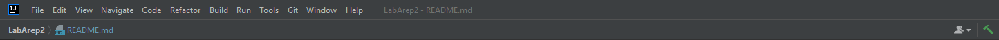

luego de que ya lo tengamos vamos a ejecutar la clase principal en este caso es lambda que esta 
en edu.eci.arep.functLambda y en esta clase corremos el metodo main, 
para que funcione nuestra clase

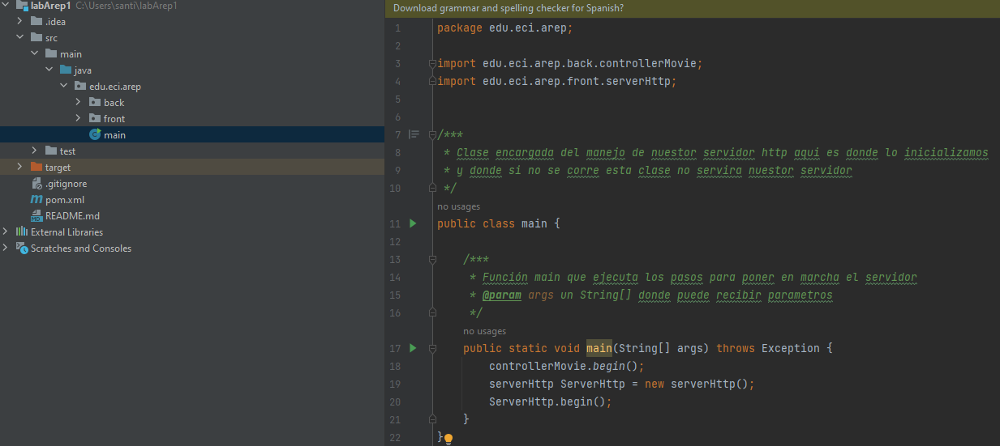

Eso hará que ya este disponible nuestra aplicacion. Para corroborar pega y copia o presiona
la siguiente url http://localhost:35000/home.html.

entrando al link podemos ver a continuacion la siguiente pagina
con la cual podemos llamar a la funcion lambda del endpoint /hello
con post y get:

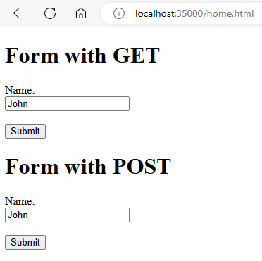

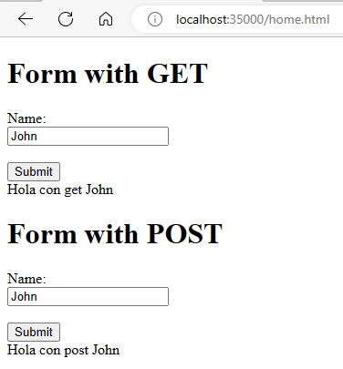

aqui en la terminal vemos como hacen los pedidos post y get

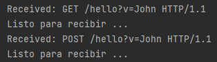

tambien lo podemos ejecutar directamente las funciones lambda en la siguiente url
http://localhost:35000/hello?v=John

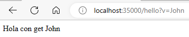


## Corriendo los tests

en este proyecto no contamos con pruebas unitarias, sino que todas las pruebas
se hicieron con la aplicacion en marcha para verificar que si pueda con los
tipos de archivos que nos piden en este laboratorio html, css, js, y imagenes
y tambien vamos a probar las diferentes funciones lambdas que tenemos
programadas en nuestro servidor

vamos a primero probar con html:

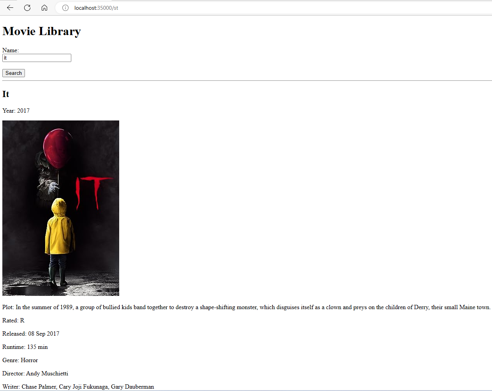

css:

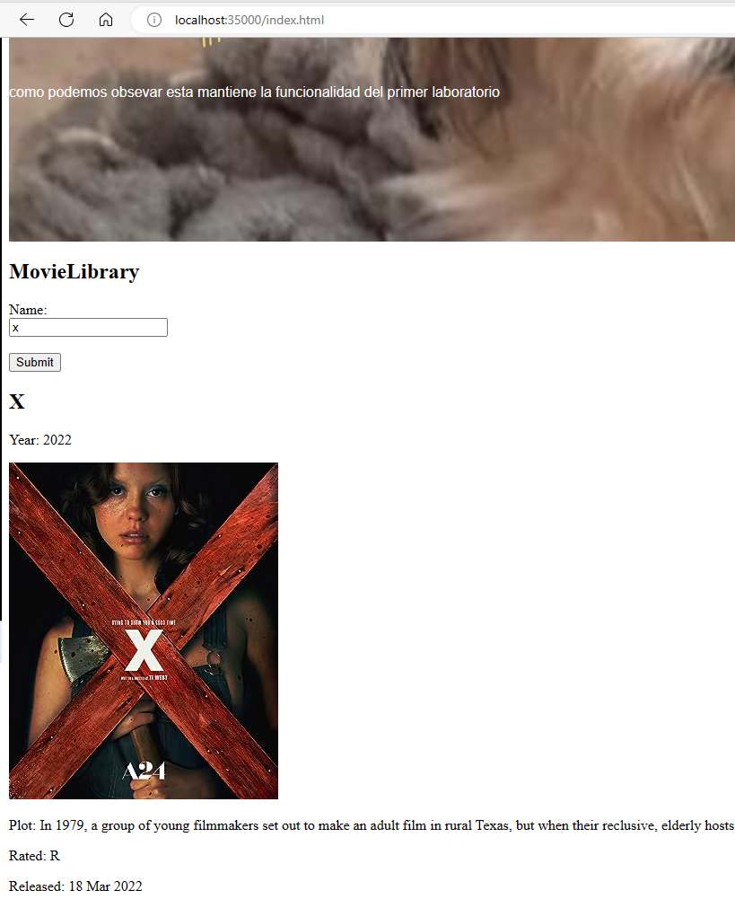

js:

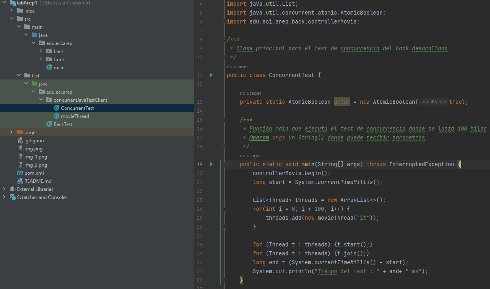

imagenes jpg:

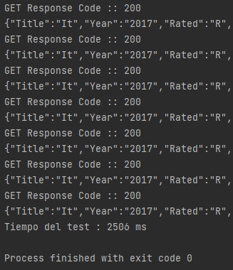

imagenes png:

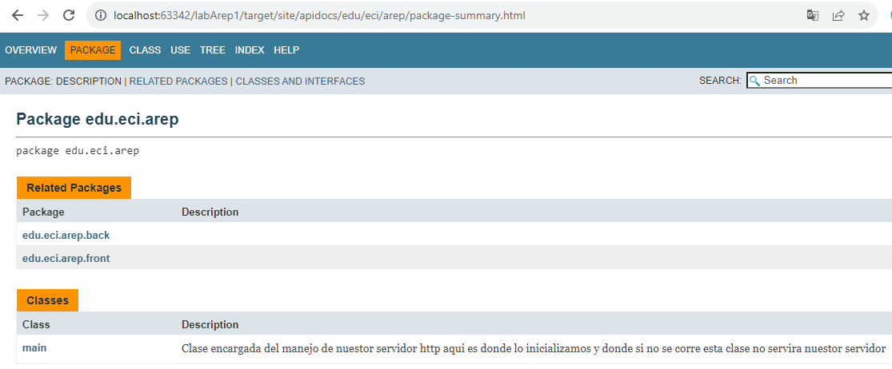

funciones lambda 

/hello:

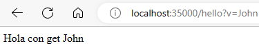

/coseno:

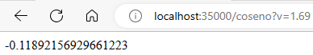

/seno:

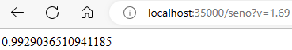

tambien cuando un archivo o funcion lambda no existe nos direcciona a la siguiente pagina:

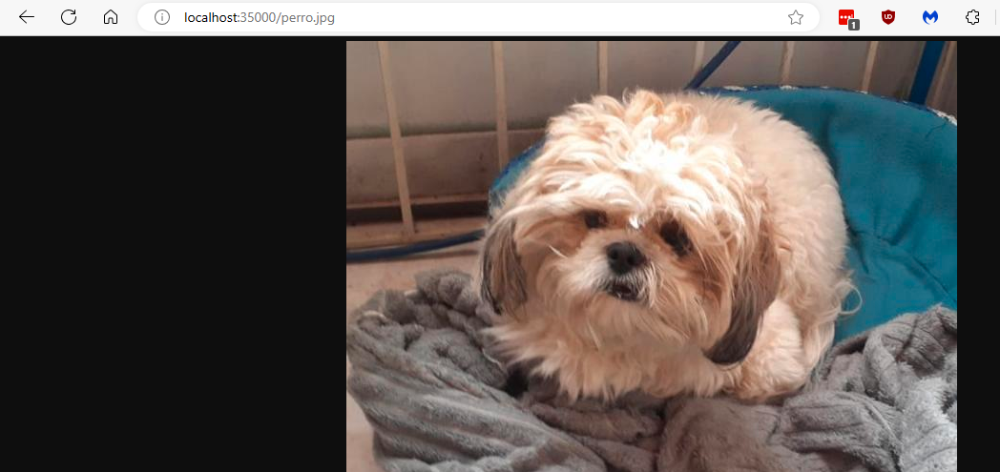

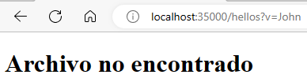

y si no manejamos un formato nos lleva a lo siguiente:

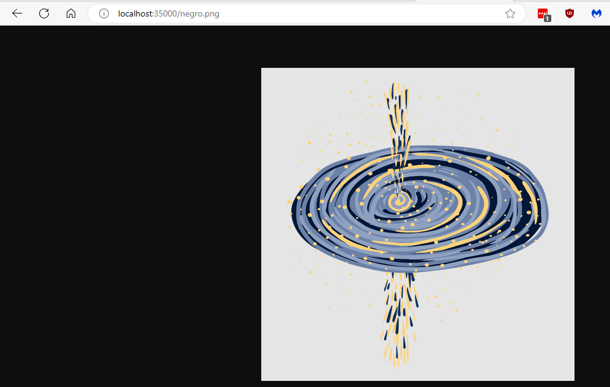

## Documentación
Primero debemos ejecutar el siguiente comando para crear la documentación.
```
mvn javadoc:javadoc
```
En la siguiente ruta desde nuestra carpeta del proyecto podemos encontrar la documentación.

```
./target/site/apidocs/
```
Si ingresamos a esta podemos ver que hay un index.html que al abrir nos mostrara la siguiente pagina.

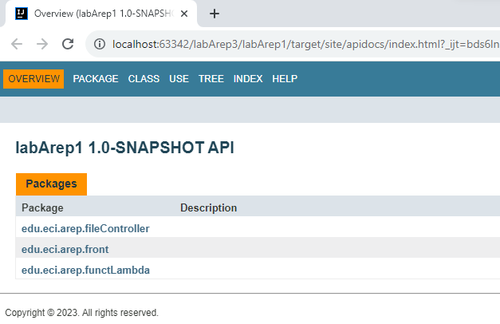

### Extensibilidad

como podemos ver en este proyecto tenemos una clase abstracta que es file
y despues la implementamos ya sea si son imagenes o texto, poreso si queremos
agregar un nuevo tipo de archivo solo debemos de crear la clase para estos archivos
sin la necesidad de tener que cambiar gran cosa en nuestro codigo, incluso el agregar
un nuevo formato de imagenes

tambien si queremos agregar una nueva funcion lambda solo tenemos que agregarla
a la clase lambda en el metodo main como podemos ver a continuacion

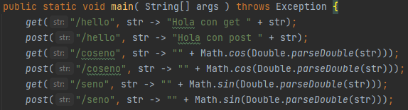

### Arquitectura

* front: en este contenemos nuestro servidor http que es el controlador
de toda nuestra arquitectura la que usa al fileController y las funciones lambdas
* fileController: es el encargador de manejar todos los tipos de archivos
que pueda manejar nuestro servidor
* functLambda: encargado de nuestro servicios web de tipo GET y POST 
usando funciones lambda, y tambien nuestra clase principal que arranca nuestro
servidor web 

### Patrones

* se puede observar estilo arquitectónico Cliente-Servidor, donde tenemos un 
servidor http que puede traer archivos con diferentes formatos y tambien
usar las diferentes funciones lamdas que programamos en nuestro servidor

### Modularización
como ya lo mencionamos anteriormente tenemos dos clases que son responsable
de los diferentes formatos para imagenes y para texto, la cual cada una
tiene una responsabilidad unica:

* textController: contiene todo lo necesario para manejar los formatos de
texto que nos pidieron html css js

* imgController: contiene todo lo necesario para manejar los formatos de
  imagenes que codificamos en nuestro servidor que en este caso son 
  jpg, png, jpeg y gif

## Construido con

* [Maven](https://maven.apache.org/) - Administrador de dependencias
* [OMDAPI](https://www.omdbapi.com) - API externa de consulta

## Version

1.0-SNAPSHOT

## Autores

Santiago Ospina Mejia

## Licencia

GNU General Public License family

## Agradecimientos

* Luis Daniel Benavides profesor de AREP

## Tener en cuenta

no se implementaron todos los formatos de imagenes que existen, se implementaron
para 4 formatos ya anteriormente mencionados, si se sube un archivo al servidor
y no maneja ese formato va a salir el error ya mostrado anteriormente donde dice
archivo no soportado.

tambien en nuestro servidor solo tenemos 3 funciones lambdas programadas que son 

/hello

/coseno

/seno